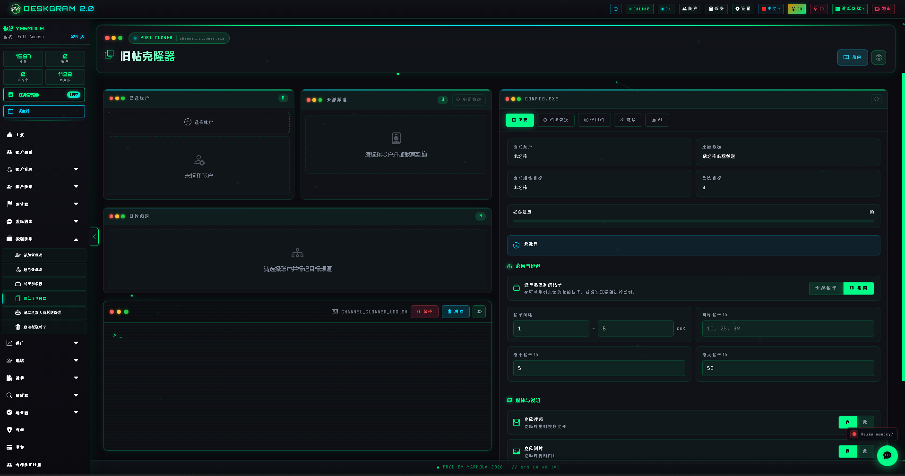
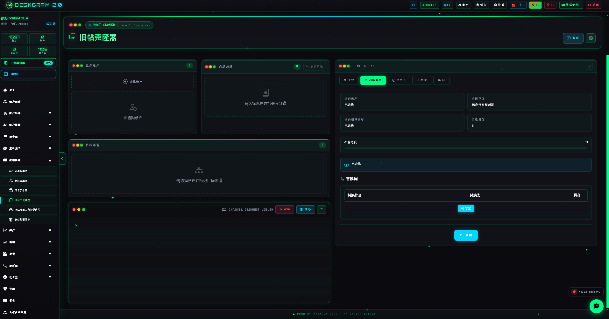
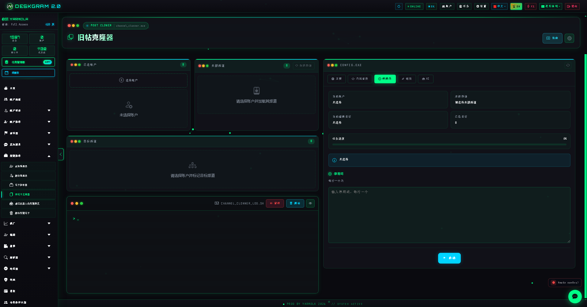
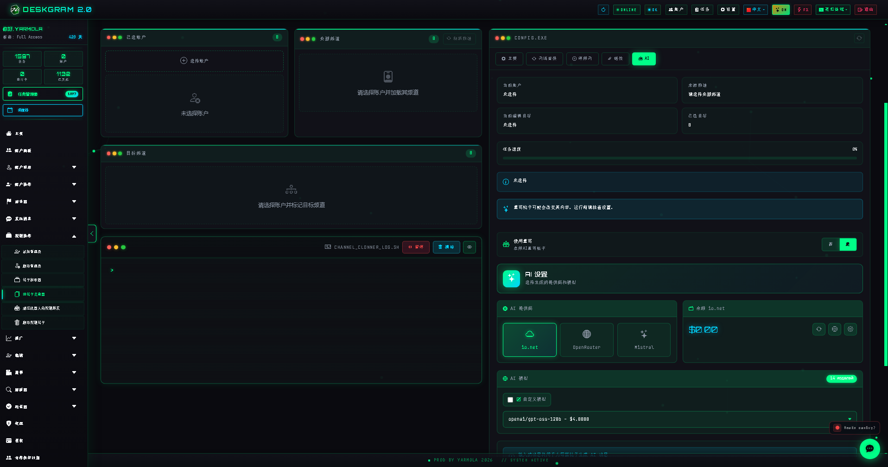

# Deskgram 2 旧帖子克隆器

Deskgram 2 的旧帖子克隆器可以把已经发布过的 Telegram 内容迁移到其他频道，并在迁移过程中应用来源-目标映射、文本替换、过滤规则、链接规则和 AI 改写，而不是简单复制粘贴。

[Deskgram 2 Hub](https://github.com/Deskgram-2/deskgram-2-telegram-automation-zh) · [Website](https://deskgram2.com/) · [Telegram Bot](https://t.me/DG2welcomebot) · [Web Preview](https://deskgram2.com/web-preview?path=%2Fapp-demo%2F&lang=cn)

## 交互式 Web Preview

浏览器中查看模块界面：[打开 web preview](https://deskgram2.com/web-preview?path=%2Fapp-demo%2Ffunctions%2Fchannel_clonner&lang=cn)

可以先查看来源-目标映射、替换标签和 AI 区块，再决定是否用于真实内容迁移。

## Screenshots

## 模块概览

| 参数 | 内容 |
|---|---|
| 核心任务 | 在频道之间克隆旧 Telegram 帖子 |
| 关键模块 | 来源、目标、映射、替换、停用词、链接、AI |
| 适用场景 | 内容复用、旧帖重启、频道内容适配 |
| 相关模块 | 帖子抓取器、任务管理、设置 |

## 模块能力

- 选择账号、来源频道和目标频道；
- 构建多个 source -> target 映射；
- 应用替换规则、停用词和链接设置；
- 使用 AI 对内容进行改写；
- 通过日志面板跟踪执行过程。

## 快速开始

1. 选择工作账号并刷新频道列表。
2. 选择来源频道和一个或多个目标频道。
3. 创建映射并逐个配置。
4. 按需添加替换、停用词、链接规则和 AI。
5. 启动任务并查看日志结果。

## FAQ

### 可以先在浏览器里看界面吗？

可以，web preview 已经直接链接在上面。

### 这个模块只是原样复制帖子吗？

不是。它更适合在复用旧内容时进行适度改写和规则控制，而不是盲目复制。
